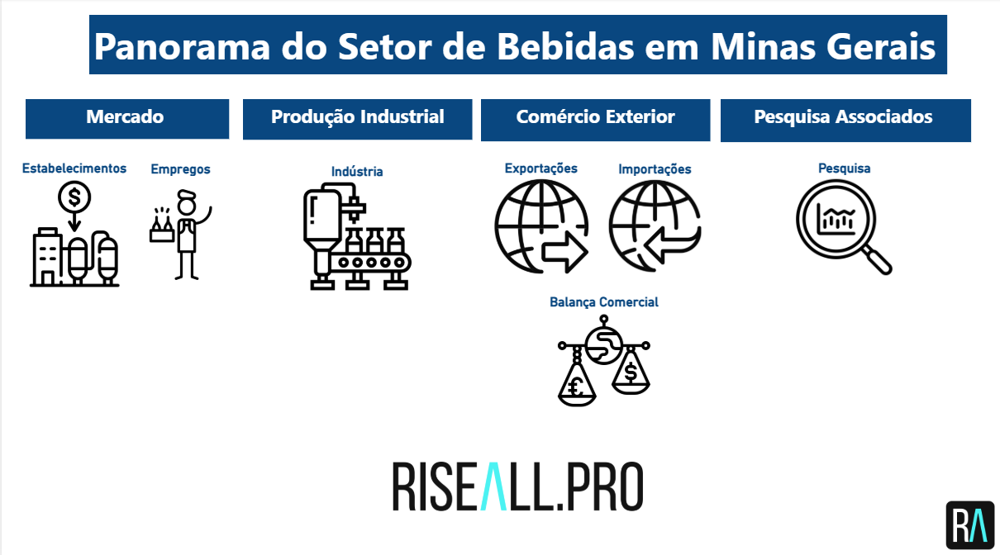
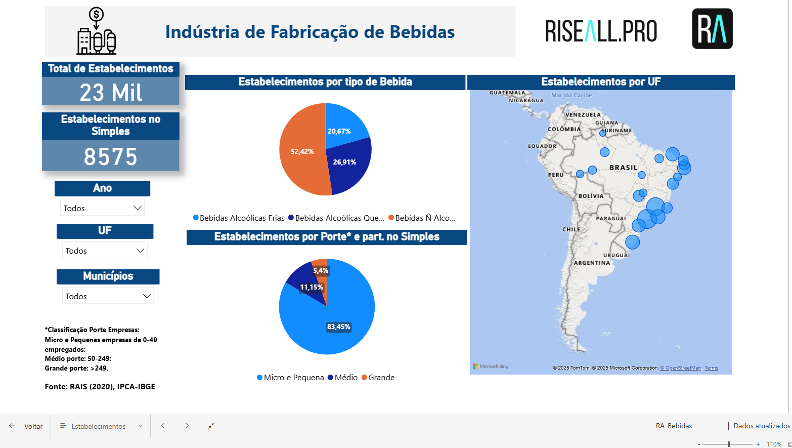
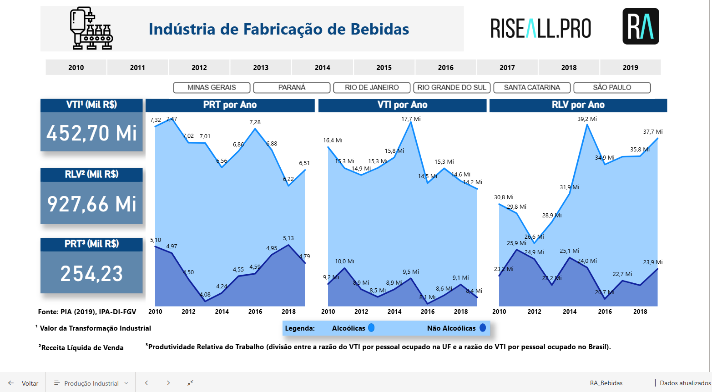
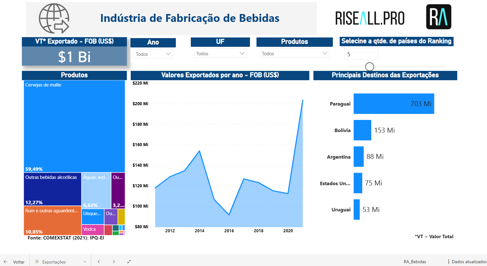
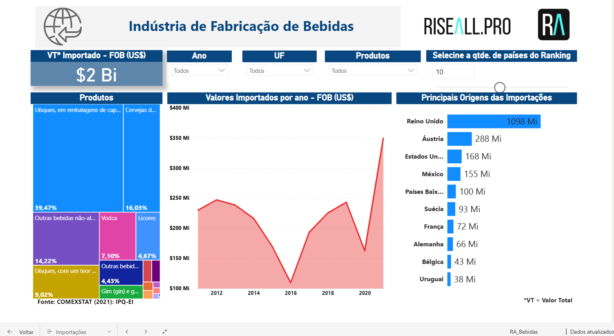
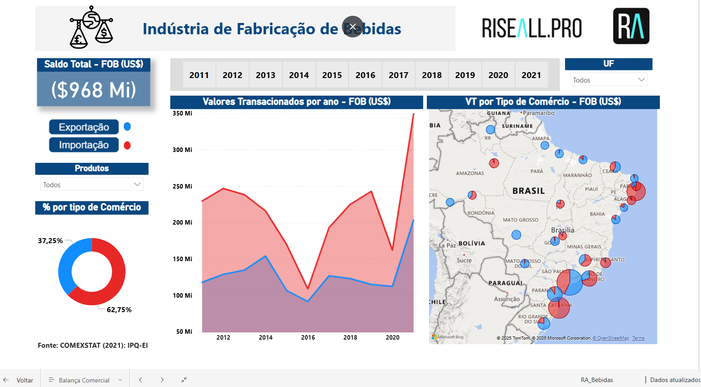
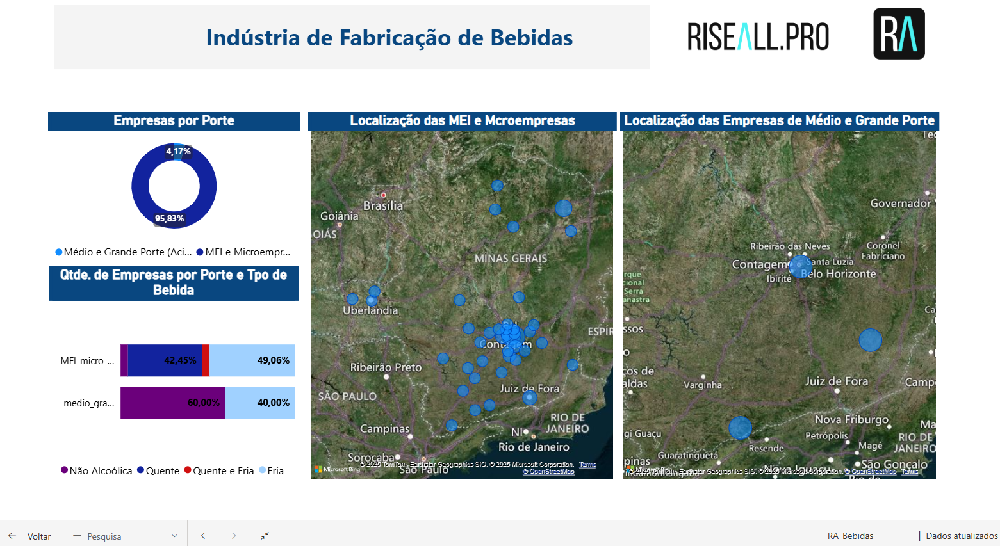

# 📊 Panorama do Setor de Bebidas em Minas Gerais

Este repositório contém um **dashboard interativo em Power BI** desenvolvido para analisar a **Indústria de Fabricação de Bebidas** em Minas Gerais e no Brasil.
O arquivo principal é **`RA_Bebidas.pbix`**, que reúne informações de mercado, produção industrial, comércio exterior e pesquisas relacionadas.

---

## 📂 Estrutura do Dashboard

### 1. **Capa / Menu Inicial**


Visão geral do painel, com acesso às seções:

* Mercado
* Produção Industrial
* Comércio Exterior
* Pesquisa de Associados

---

### 2. **Estabelecimentos**



* Total de estabelecimentos: **23 mil**
* Estabelecimentos no Simples: **8.575**
* Distribuição por tipo de bebida (alcoólicas frias, quentes e não alcoólicas)
* Estabelecimentos por porte (micro, pequenas, médias e grandes empresas)
* Mapa por UF

---

### 3. **Empregos**


* Total de empregados: **1 milhão**
* Salário médio: **R\$ 1,81 mil**
* Massa salarial: **R\$ 3,80 bilhões**
* Distribuição da massa salarial por categoria
* Empregados por nível de escolaridade
* Percentual por ocupação

---

### 4. **Produção Industrial**



* Indicadores principais:

  * **VTI (Valor da Transformação Industrial)**
  * **RLV (Receita Líquida de Vendas)**
  * **PRT (Produtividade Relativa do Trabalho)**
* Séries históricas (2010–2019)
* Comparação entre estados (MG, PR, RJ, RS, SC, SP)
* Segmentação: bebidas alcoólicas e não alcoólicas

---

### 5. **Exportações**



* Valor total exportado: **US\$ 1 bilhão**
* Principais produtos: cerveja de malte, rum, vodka, uísque, águas engarrafadas
* Destinos principais: Paraguai, Bolívia, Argentina, EUA e Uruguai

---

### 6. **Importações**



* Valor total importado: **US\$ 2 bilhões**
* Principais produtos: uísques, cervejas, licores, vodka e gim
* Principais origens: Reino Unido, Áustria, EUA, México e Países Baixos

---

### 7. **Balança Comercial**



* Saldo total: **–US\$ 968 milhões**
* Evolução das exportações e importações
* % por tipo de comércio
* Distribuição por UF

---

### 8. **Pesquisa de Associados**



* Empresas por porte (MEI, micro, médias e grandes)
* Localização das MEI e microempresas
* Localização das empresas de médio e grande porte
* Segmentação por tipo de bebida

---

## 🎯 Objetivo

O painel foi desenvolvido para oferecer uma visão clara e interativa sobre o setor de bebidas, permitindo:

* Identificação de oportunidades de mercado
* Análise de competitividade regional
* Avaliação do desempenho industrial
* Monitoramento do comércio internacional

---

## 🛠️ Fontes de Dados

* **RAIS (2020)** – Relação Anual de Informações Sociais
* **PIA (2019), IPA-DI/FGV** – Pesquisa Industrial Anual
* **COMEXSTAT (2021)** – Estatísticas de Comércio Exterior

---

## 🚀 Como Utilizar

1. Baixe o arquivo **`RA_Bebidas.pbix`**.
2. Abra-o no **Power BI Desktop**.
3. Explore as páginas temáticas utilizando filtros (ano, UF, município, produto).

---

## 📌 Estrutura do Repositório

```
├── RA_Bebidas.pbix   # Arquivo principal do Power BI
├── /imagens          # Capturas de tela dos dashboards
│   ├── p1.png        # Menu Inicial
│   ├── p2.png        # Estabelecimentos
│   ├── p3.png        # Empregos
│   ├── p4.png        # Produção Industrial
│   ├── p5.png        # Exportações
│   ├── p6.png        # Importações
│   ├── p7.png        # Balança Comercial
│   └── p8.png        # Pesquisa de Associados
├── README.md         # Documentação do projeto
```
